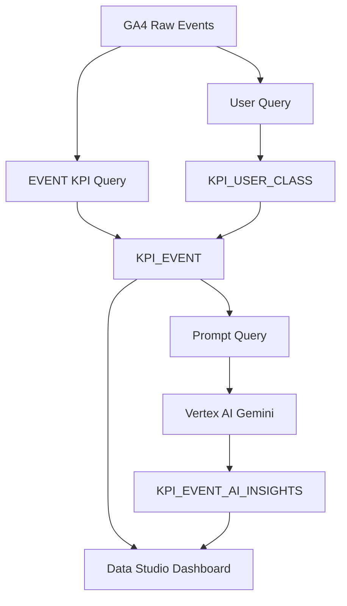

# OOO교육기업 이벤트 마케팅 KPI AI Insight 분석

GA4 BigQuery 데이터를 기반으로 이벤트별 마케팅 KPI를 자동 집계하고,  
Vertex AI Gemini로 실행 액션 중심의 인사이트를 생성하는 마케팅 성과 분석 대시보드입니다.

단순 이벤트 특성 리포트가 아니라,  
**이벤트가 성과, 이벤트를 개선, 다음 액션**를 빠르게 판단이 가능합니다.

GA4 데이터 수집 → BigQuery KPI 집계 → 유저 군집 분석 → Vertex AI 인사이트 생성 → DATA Studio 시각화

---

## DASHBORAD

- X축: 페이지 반응 또는 전환 관련 지표
- Y축: 구매전환 또는 참여전환 지표
- 버블 크기: 유입 또는 매출 규모
- 색상: 이벤트 성과 유형 또는 추천 액션
- 필터: 기간, 이벤트코드, 생성일자
  
---

## 목차

1. [프로젝트 개요](#1-프로젝트-개요)
2. [전체 시스템 구조 및 기술 스택](#2-전체-시스템-구조-및-기술-스택)
3. [프로젝트 목적 및 방법](#3-프로젝트-목적-및-방법)
4. [대시보드 및 분석 결과](#4-대시보드-및-분석-결과)
5. [핵심 분석 방법](#5-핵심-분석-방법)
6. [AI 인사이트 생성](#6-ai-인사이트-생성)
7. [자동화 구조](#7-자동화-구조)
8. [데이터 구조](#8-데이터-구조)
9. [프로젝트 결과](#9-프로젝트-결과)
    
--- 

## 1. [프로젝트 개요]

| 구분  | 내용                                                                                         |
| --- | ------------------------------------------------------------------------------------------ |
| 문제점  | 이벤트별 성과 데이터는 많지만, 성과 기반으로 어떤 이벤트를 개선해야 하는지 판단하기 어려움 |
| 목적    | GA4 기반으로 이벤트별 KPI를 자동 집계하고, 실행 액션까지 연결되는 분석 대시보드를 구축 |
| 방법    | 유저 특성 만들고 그리고 군집 말들고 그리고 이벤트 분석하고 그거 세가 다 합쳐서 결합한 뒤 Vertex AI Gemini로 이벤트별 인사이트를 자동 생성  |
| 결과    | 실무자는 Data Studio에서 이벤트별 성과, 기간별 흐름, 방문자 성향, AI 추천 액션 데이터 기반으로 마케팅 의사결정 가능 |

---
## 2. [전체 시스템 구조 및 기술 스택]

### 전체 시스템 구조

---

### 기술 스택

| 구분 | 사용 기술 |
|---|---|
| 데이터 소스 | GA4 Export |
| 데이터 웨어하우스 | BigQuery |
| 데이터 처리 | BigQuery SQL |
| AI 인사이트 생성 | Vertex AI Gemini |
| 자동화 실행 | Cloud Run Jobs |
| 스케줄링 | Cloud Scheduler |
| 시각화 | Data Studio |
| 컨테이너 | Docker, Artifact Registry |
| 언어 | Python, SQL |
  
---

## 3. [프로젝트 목적 및 방법]

  
---

## 4. [대시보드 및 분석 결과]

  
---

## 5. [핵심 분석 방법]

  
---

## 6. [AI 인사이트 생성]

  
---

## 7. [자동화 구조]

  
---

## 8. [데이터 구조]

  
---

## 9. [프로젝트 결과]

