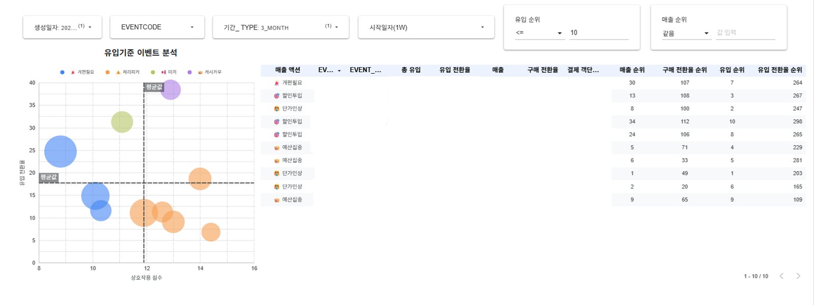
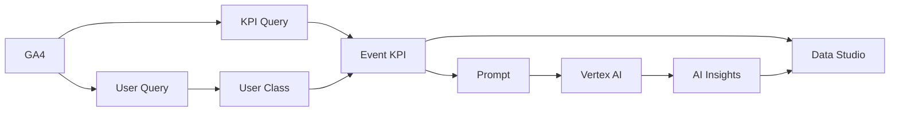
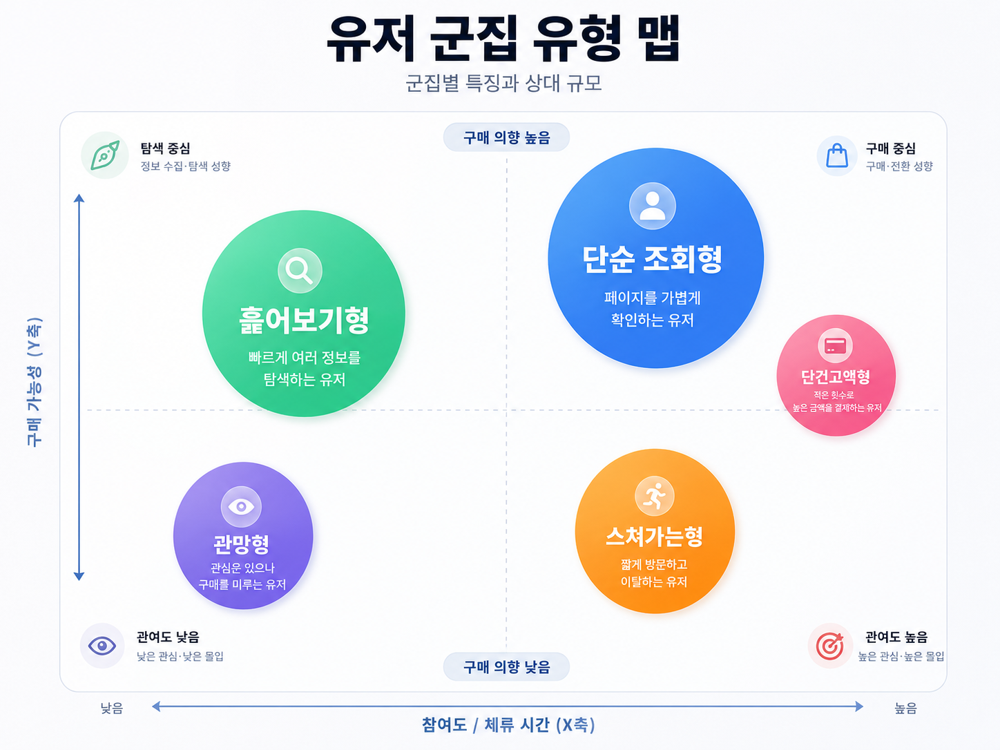

# 📊 OOO교육기업 이벤트 마케팅 AI INSIGHT 분석 📊

 

GA4 BigQuery 데이터를 기반으로 이벤트별 마케팅 KPI를 자동 집계하고,  
Vertex AI Gemini로 실행 액션 중심의 인사이트를 생성하는 마케팅 성과 분석 대시보드입니다.

단순 이벤트 특성 리포트가 아니라,  
**이벤트가 성과, 이벤트를 개선, 다음 액션**를 빠르게 판단이 가능합니다.

GA4 데이터 수집 → BigQuery KPI 집계 → 유저 군집 분석 → Vertex AI 인사이트 생성 → DATA Studio 시각화

---
 

## 🌟PREVIEW🌟

### 기존 방식

  

이벤트별 유입, 매출, 전환율 데이터를 각각 확인해야 했고,  
성과가 좋은 이벤트와 개선이 필요한 이벤트를 빠르게 구분하기 어려웠습니다.

### 구축 후

  

  
    X축: UX 상호작용 점수 / Y축: 구매·참여 전환율 / 버블 크기: 유입·매출 규모 / 색상: 이벤트 성과 유형 또는 추천 액션 / 필터: 기간, 이벤트코드, 생성일자, 유입, 매출 규모
  

  

  
    Vertex AI Gemini 기반 이벤트별 성과 요약 및 실행 액션 도출 화면
  

---

## 목차
0. [목차](#목차로-되돌아가기)
1. [📑 프로젝트 개요](#1-프로젝트-개요)
2. [📔 전체 시스템 구조 및 기술 스택](#2-전체-시스템-구조-및-기술-스택)
3. [🧰 대시보드 및 분석 결과](#3-대시보드-및-분석-결과)
4. [🖥️ 상세 분석 로직](#4-상세-분석-로직)
5. [📊 데이터 구조](#5-데이터-구조)
6. [📜 프로젝트 결과](#6-프로젝트-결과)
 
--- 

   

## 1. [📑 프로젝트 개요]

| 구분  | 내용                                                                                         |
| -------     | ------------------------------------------------------------------------------------------ |
| 문제점  | 이벤트별 성과 데이터는 많지만, 성과 기반으로 어떤 이벤트를 개선해야 하는지 판단하기 어려움 |
| 목적    | GA4 기반으로 이벤트별 KPI를 자동 집계하고, 실행 액션까지 연결되는 분석 대시보드를 구축 |
| 방법    | 유저 특성 및 군집 분석 후, 이벤트 분석과 결합한 뒤 Vertex AI Gemini로 이벤트별 인사이트를 자동 생성  |
| 결과    | 실무자는 Data Studio에서 이벤트별 성과, 기간별 흐름, 방문자 성향, AI 추천 액션 데이터 기반으로 마케팅 의사결정 가능 |

 

---

 

## 2. [📔 전체 시스템 구조 및 기술 스택]

### 전체 시스템 구조

GA4 데이터 수집 → BigQuery KPI 집계 → 유저 군집 분석 → Vertex AI 인사이트 생성 → DATA Studio 시각화

---

### 기술 스택

  
   
  
   
  
   
  
   
  
   
  
   
  
   
  
   
  

 

* [목차로 되돌아가기](#목차로-되돌아가기)
---

   

## 3. [🧰 대시보드 및 분석 결과]

이벤트 성과를 단순히 유입 수나 매출만으로 판단하지 않고,  
**유저 행동, 전환 흐름, 상대 순위, 기간 변화, 유저 군집**을 함께 반영하도록 설계했습니다.

**분석 흐름: 유저 행동 분석 → 유저 군집 분석 → 이벤트 성과 분석 → 이벤트+유저 데이터 결합 → AI 인사이트 생성**

분석 결과는 크게 두 관점으로 나누어 확인할 수 있습니다.

- 유입 관점: 유입 및 이벤트 탐색 깊이
- 매출 관점: 매출 밒 객단가

   

---

   

### 3.1 유저 행동 및 군집 분석

  

1. 유저 행동 분석
GA4 이벤트 로그를 기반으로 유저의 행동을 세션 단위로 집계했습니다.

| 지표 | 의미 |
|---|---|
| 방문 수 | 이벤트에 유입된 사용자 규모 |
| 클릭 수 | 페이지 안에서 발생한 상호작용 정도 |
| 체류 시간 | 페이지에 머문 시간 |
| 스크롤 깊이 | 콘텐츠를 얼마나 내려봤는지 |
| 구매 여부 | 실제 결제로 이어졌는지 |
| 매출 | 이벤트를 통해 발생한 구매 금액 |
| 다음 여정 이동 | 다른 이벤트나 페이지로 이어졌는지 |

2. KMeans 군집 분석 및 Vertex AI 그룹명
   
| 군집명 | 해석 |
|---|---|
| 단순 조회형 | 페이지를 가볍게 확인하는 유저 |
| 훑어보기형 | 빠르게 여러 정보를 탐색하는 유저 |
| 단건고액형 | 적은 횟수로 높은 금액을 결제하는 유저 |
| 스쳐가는형 | 짧게 방문하고 이탈하는 유저 |
| 관망형 | 관심은 있으나 구매를 미루는 유저 |

이 군집 정보는 이후 이벤트별 유저 구성 비중으로 연결되어,  

특정 이벤트가 어떤 성향의 유저를 많이 유입시키는지 판단하는 데 사용됩니다.

   

---

   

### 3.2 이벤트 성과 분석

  

이벤트별 유입, 페이지 반응, 구매전환, 참여전환, 매출 성과를 한 화면에서 비교할 수 있도록 구성

| 기능 | 설명 |
|---|---|
| 기간별 필터링 | 3개월, 1개월, 주차별 성과 확인 |
| 이벤트 비교 | 이벤트별 유입, 매출, 전환율 비교 |
| 사분면 분석 | 평균 기준으로 이벤트 성과 유형 분류 |
| 유저 군집 비중 | 이벤트별 방문자 성향 확인 |
| 추천 액션 | 이벤트 성과 유형에 따른 개선 방향 확인 |
| AI 인사이트 | Vertex AI가 생성한 이벤트별 요약과 실행 액션 확인 |

  

각 이벤트는 페이지 반응과 전환 성과를 기준으로 사분면에 배치됩니다.

| 구분 | 해석 |
|---|---|
| 페이지 반응 높음 + 구매전환 높음 | 성과가 좋은 핵심 이벤트 |
| 페이지 반응 높음 + 구매전환 낮음 | 관심은 있으나 구매 설득이 부족한 이벤트 |
| 페이지 반응 낮음 + 구매전환 높음 | 목적 구매 성향이 강한 이벤트 |
| 페이지 반응 낮음 + 구매전환 낮음 | 개선 또는 종료 검토가 필요한 이벤트 |

   

---

   

### 3.3 이벤트 데이터와 유저 데이터 결합

이벤트별 성과만 보는 것이 아니라,  
해당 이벤트에 유입된 유저가 어떤 군집에 속하는지도 함께 반영했습니다.

이를 통해 다음과 같은 해석이 가능해졌습니다.

| 예시 | 해석 |
|---|---|
| 유입은 많지만 관망형 비중이 높음 | 관심은 있으나 구매 설득이 부족할 가능성 |
| 유입은 적지만 단건고액형 비중이 높음 | 고액 구매 가능성이 있는 타겟 이벤트 |
| 스쳐가는형 비중이 높음 | 콘텐츠 전달력 또는 랜딩 품질 개선 필요 |
| 훑어보기형 비중이 높음 | 비교 탐색 단계의 유저가 많은 이벤트 |

   

---

   

### 3.4 AI 인사이트 도출

최종적으로 이벤트 성과, 전체 순위, 사분면 위치, 유저 군집 비중, 기간별 흐름을 결합해 AI 인사이트를 생성했습니다.

AI 인사이트는 다음 4가지 기준으로 생성됩니다.

| 인사이트 유형 | 설명 |
|---|---|
| `3_MONTH` | 최근 3개월 기준 장기 성과 |
| `1_MONTH` | 최근 1개월 기준 단기 성과 |
| `1_WEEK` | 주차별 최근 성과 |
| `TOTAL` | 3개월, 1개월, 주차 흐름을 종합한 최종 판단 |

   

---

   

### 3.5 전체 대시보드

**<유입기준>**

  

  
    이벤트별 유입, 전환율, 매출, 유저 군집 비중을 함께 확인하는 성과 분석 화면
  

  

  
    이벤트별 AI 요약, 성과 해석, 다음 실행 액션 확인 화면
  

   

**<매출기준>**

  

  
    이벤트별 유입, 전환율, 매출, 유저 군집 비중을 함께 확인하는 성과 분석 화면
  

  

  
    이벤트별 AI 요약, 성과 해석, 다음 실행 액션 확인 화면
  

* [목차로 되돌아가기](#목차로-되돌아가기)

   

---

   

## 4. [🖥️ 상세 분석 로직]

자세한 분석 로직은 아래 영역을 펼쳐서 확인할 수 있습니다.

<strong>4.1 기간별 성과 비교</strong>

 

이벤트 성과는 하나의 기간만 보지 않고, 여러 기간 단위로 나누어 비교했습니다.

| 기간 | 설명 |
|---|---|
| `3_MONTH` | 최근 3개월 기준 장기 흐름 |
| `1_MONTH` | 최근 1개월 기준 단기 흐름 |
| `1_WEEK` | 주차별 최근 변화 |
| `TOTAL` | 3개월, 1개월, 주차 흐름을 종합한 판단 |

이 구조를 통해 특정 이벤트가 장기적으로 좋은 이벤트인지,  
최근 들어 성과가 좋아졌는지 또는 나빠졌는지 확인할 수 있습니다.

---

<strong>4.2 상대 순위 분석</strong>

 

이벤트의 수치가 높거나 낮은지를 단독으로 판단하지 않고,  
같은 기간 내 전체 이벤트와 비교했습니다.

비교한 순위 지표는 다음과 같습니다.

| 순위 지표 | 의미 |
|---|---|
| 유입 순위 | 전체 이벤트 중 유입 규모 순위 |
| 매출 순위 | 전체 이벤트 중 매출 순위 |
| 페이지 반응 순위 | 전체 이벤트 중 UX 반응 점수 순위 |
| 구매 전환 순위 | 전체 이벤트 중 구매 전환율 순위 |
| 참여 전환 순위 | 전체 이벤트 중 참여 전환율 순위 |
| 객단가 순위 | 전체 이벤트 중 구매자당 평균 매출 순위 |

예를 들어 유입 수가 많아 보여도 전체 이벤트 중 하위권일 수 있고,  
매출이 작아 보여도 같은 기간 내에서는 상위권일 수 있습니다.  
따라서 전체 이벤트 안에서의 상대적 위치를 함께 반영하도록 설계했습니다.

---

<strong>4.3 사분면 분석</strong>

 

이벤트의 성과를 직관적으로 파악하기 위해 평균값을 기준으로 사분면 분석을 수행했습니다.

구매 관점에서는 페이지 반응과 구매전환율을 기준으로 이벤트를 나누었습니다.

| 구분 | 해석 |
|---|---|
| 페이지 반응 높음 + 구매전환 높음 | 핵심 성과 이벤트 |
| 페이지 반응 높음 + 구매전환 낮음 | 관심은 있지만 구매 설득이 부족한 이벤트 |
| 페이지 반응 낮음 + 구매전환 높음 | 목적 구매 성향이 강한 이벤트 |
| 페이지 반응 낮음 + 구매전환 낮음 | 개선 또는 종료 검토가 필요한 이벤트 |

참여 관점에서는 페이지 반응과 참여전환율을 기준으로 이벤트를 다시 분류했습니다.  
이를 통해 이벤트가 구매를 만드는 역할인지, 유입과 탐색을 만드는 역할인지 구분할 수 있도록 했습니다.

---

<strong>4.4 최종 인사이트 결합</strong>

 

최종적으로 다음 요소를 결합해 이벤트별 인사이트를 생성했습니다.

| 요소 | 설명 |
|---|---|
| 유저 행동 지표 | 방문, 클릭, 체류, 스크롤, 구매 행동 |
| 유저 군집 비중 | 이벤트별 방문자 성향 |
| 기간별 성과 변화 | 장기, 단기, 주차별 흐름 |
| 전체 이벤트 내 상대 순위 | 유입, 매출, 전환율, 객단가 순위 |
| 구매 관점 사분면 | 구매 성과 기준 이벤트 유형 |
| 참여 관점 사분면 | 참여 성과 기준 이벤트 유형 |
| 유입·매출 관점 | 유입형 이벤트와 매출형 이벤트 구분 |

이 구조를 통해 단순히 “성과가 좋다/나쁘다”가 아니라,  
왜 그런 성과가 나왔는지와 앞으로 어떤 액션을 해야 하는지를 함께 판단할 수 있도록 했습니다.

---

<strong>4.5 자동화 구조</strong>

 

자동화는 실행 주기에 따라 일별 자동화와 분기별 자동화로 나누었습니다.

| 구분 | 실행 내용 |
|---|---|
| 일별 자동화 | 이벤트 KPI 테이블 갱신, AI 인사이트 생성, Data Studio 대시보드 갱신 |
| 분기별 자동화 | 최근 6개월 유저 행동 데이터 기반 군집 분석, 유저 군집명 갱신 |

일별 자동화는 매일 최신 이벤트 성과를 반영하기 위해 실행했습니다.  
유저 군집은 매일 크게 변하지 않기 때문에 분기 단위로 갱신하도록 설계했습니다.

* [목차로 되돌아가기](#목차로-되돌아가기)

   

---

   

## 5. [📊 데이터 구조]

이 프로젝트는 이벤트 성과, AI 인사이트, 유저 군집 정보를 각각 분리된 테이블로 관리했습니다.

| 테이블 | 설명 |
|---|---|
| `KPI_EVENT_TEST` | 이벤트별 KPI, 순위, 사분면, 유저 군집 비중을 저장하는 메인 테이블 |
| `KPI_EVENT_TEST_AI_INSIGHTS` | 이벤트별 AI 인사이트 결과를 저장하는 테이블 |
| `KPI_USER_CLASS` | 유저별 군집 번호와 군집명을 저장하는 테이블 |

---

<strong>5.1 KPI_EVENT_TEST</strong>

 

`KPI_EVENT_TEST`는 이벤트별 성과 지표를 저장하는 메인 테이블입니다.  
Looker Studio 대시보드의 버블 차트, 이벤트 테이블, 필터 구성에 사용됩니다.

| 컬럼 | 설명 |
|---|---|
| `WDATE` | 데이터 생성 기준일 |
| `period_type` | 분석 기간 유형 |
| `start_date`, `end_date` | 분석 시작일과 종료일 |
| `EVENTCODE` | 이벤트 코드 |
| `event_url` | 이벤트 URL |
| `users` | 유저 수 |
| `ux_score` | 페이지 반응 점수 |
| `s_cvr` | 구매 전환율 |
| `i_cvr` | 참여 전환율 |
| `rev` | 매출 |
| `arppu` | 구매자당 평균 매출 |
| `g1_pct ~ g6_pct` | 유저 군집별 비중 |
| `g1_name ~ g6_name` | 유저 군집명 |
| `s_quad`, `s_act` | 구매 관점 사분면 및 추천 액션 |
| `i_quad`, `i_act` | 참여 관점 사분면 및 추천 액션 |
| `users_rank`, `rev_rank` | 유입 순위, 매출 순위 |
| `ux_rank`, `s_cvr_rank`, `i_cvr_rank` | 페이지 반응, 구매전환, 참여전환 순위 |
| `arppu_rank` | 객단가 순위 |
| `IDX` | 대시보드 연결용 인덱스 |

---

<strong>5.2 KPI_EVENT_TEST_AI_INSIGHTS</strong>

 

`KPI_EVENT_TEST_AI_INSIGHTS`는 Vertex AI가 생성한 이벤트별 인사이트 결과를 저장하는 테이블입니다.  
Looker Studio에서 이벤트별 요약과 상세 인사이트를 표시하는 데 사용됩니다.

| 컬럼 | 설명 |
|---|---|
| `WDATE` | 인사이트 생성 기준일 |
| `EVENTCODE` | 이벤트 코드 |
| `AI_SUMMARY` | 짧은 요약 제목 |
| `AI_INSIGHT` | 실행 액션 중심의 상세 인사이트 |
| `IDX` | 이벤트 연결용 인덱스 |
| `INSIGHT_TYPE` | 인사이트 유형 |
| `period_type` | 분석 기간 유형 |
| `start_date`, `end_date` | 분석 시작일과 종료일 |

`INSIGHT_TYPE`은 다음과 같이 구성됩니다.

| 유형 | 설명 |
|---|---|
| `3_MONTH` | 최근 3개월 기준 인사이트 |
| `1_MONTH` | 최근 1개월 기준 인사이트 |
| `1_WEEK` | 주차별 인사이트 |
| `TOTAL` | 3개월, 1개월, 주차 흐름을 종합한 인사이트 |

---

<strong>5.3 KPI_USER_CLASS</strong>

 

`KPI_USER_CLASS`는 유저별 군집 분석 결과를 저장하는 테이블입니다.  
이 테이블은 이벤트 KPI 생성 시 조인되어 이벤트별 유저 군집 비중을 계산하는 데 사용됩니다.

| 컬럼 | 설명 |
|---|---|
| `quarter_id` | 군집 분석 기준 분기 |
| `unified_user_id` | 통합 유저 ID |
| `persona_group` | 유저 군집 번호 |
| `persona_name` | 유저 군집명 |
| `updated_at` | 갱신 시각 |

---

   

### 5.4 테이블 간 연결 구조

세 테이블은 다음 기준으로 연결됩니다.

| 연결 | 기준 |
|---|---|
| 이벤트 KPI ↔ AI 인사이트 | `WDATE`, `EVENTCODE`, `IDX` |
| 이벤트 KPI ↔ 유저 군집 | `unified_user_id` 기준 조인 후 이벤트별 군집 비중 계산 |
| 대시보드 필터 연결 | `WDATE`, `EVENTCODE`, `period_type`, `INSIGHT_TYPE` |

이 구조를 통해 Looker Studio에서 특정 이벤트를 선택하면, 해당 이벤트의 성과 지표와 AI 인사이트를 함께 확인할 수 있습니다.

* [목차로 되돌아가기](#목차로-되돌아가기)

   

---

   

## 6. [📜 프로젝트 결과]

이 프로젝트를 통해 이벤트별 성과를 단순 수치가 아닌 실행 액션 중심으로 확인할 수 있게 되었습니다.

| 결과 | 설명 |
|---|---|
| 성과 판단 시간 단축 | 이벤트별 KPI와 AI 인사이트를 한 화면에서 확인 |
| 우선순위 선정 | 개선이 필요한 이벤트와 확장할 이벤트를 구분 |
| 전환 약점 발견 | 유입은 많지만 구매가 약한 이벤트 식별 |
| 확장 기회 발견 | 구매 전환은 높지만 유입이 적은 이벤트 식별 |
| 성과 악화 감지 | 기간별 흐름을 통해 최근 성과 하락 이벤트 확인 |
| 자연어 인사이트 제공 | 실무자가 바로 이해할 수 있는 형태로 액션 제안 |

* [목차로 되돌아가기](#목차로-되돌아가기)

   

