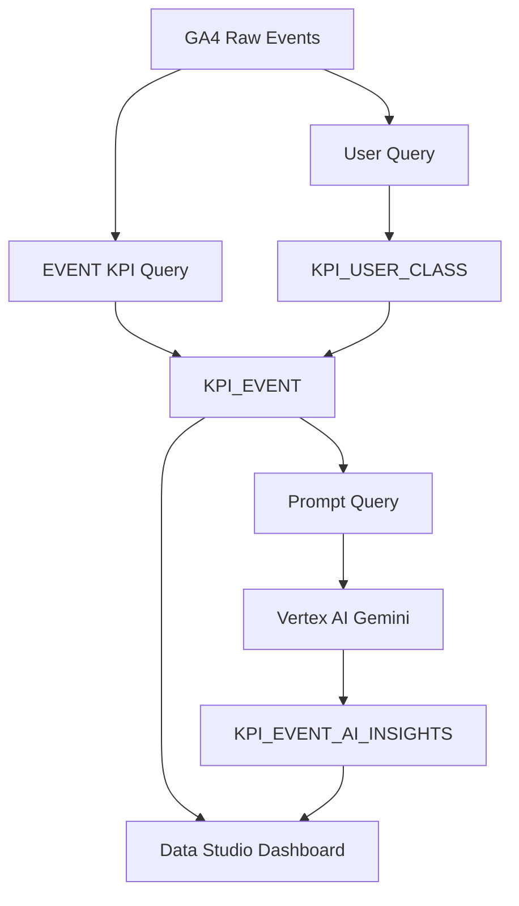

# OOO교육기업 이벤트 마케팅 KPI AI Insight 분석

GA4 BigQuery 데이터를 기반으로 이벤트별 마케팅 KPI를 자동 집계하고,  
Vertex AI Gemini로 실행 액션 중심의 인사이트를 생성하는 마케팅 성과 분석 대시보드입니다.

단순 이벤트 특성 리포트가 아니라,  
**이벤트가 성과, 이벤트를 개선, 다음 액션**를 빠르게 판단이 가능합니다.

GA4 데이터 수집 → BigQuery KPI 집계 → 유저 군집 분석 → Vertex AI 인사이트 생성 → DATA Studio 시각화

---

## PREVIEW

  
  

- X축: 페이지 반응 또는 전환 관련 지표
- Y축: 구매전환 또는 참여전환 지표
- 버블 크기: 유입 또는 매출 규모
- 색상: 이벤트 성과 유형 또는 추천 액션
- 필터: 기간, 이벤트코드, 생성일자
  
---

## 목차
0. [목차](#목차로-되돌아가기)
1. [프로젝트 개요](#1-프로젝트-개요)
2. [전체 시스템 구조 및 기술 스택](#2-전체-시스템-구조-및-기술-스택)
3. [프로젝트 목적 및 방법](#3-프로젝트-목적-및-방법)
4. [대시보드 및 분석 결과](#4-대시보드-및-분석-결과)
5. [핵심 분석 방법](#5-핵심-분석-방법)
6. [AI 인사이트 생성](#6-ai-인사이트-생성)
7. [자동화 구조](#7-자동화-구조)
8. [데이터 구조](#8-데이터-구조)
9. [프로젝트 결과](#9-프로젝트-결과)
    
--- 

## 1. [프로젝트 개요]

| 구분  | 내용                                                                                         |
| --- | ------------------------------------------------------------------------------------------ |
| 문제점  | 이벤트별 성과 데이터는 많지만, 성과 기반으로 어떤 이벤트를 개선해야 하는지 판단하기 어려움 |
| 목적    | GA4 기반으로 이벤트별 KPI를 자동 집계하고, 실행 액션까지 연결되는 분석 대시보드를 구축 |
| 방법    | 유저 특성 만들고 그리고 군집 말들고 그리고 이벤트 분석하고 그거 세가 다 합쳐서 결합한 뒤 Vertex AI Gemini로 이벤트별 인사이트를 자동 생성  |
| 결과    | 실무자는 Data Studio에서 이벤트별 성과, 기간별 흐름, 방문자 성향, AI 추천 액션 데이터 기반으로 마케팅 의사결정 가능 |

---
## 2. [전체 시스템 구조 및 기술 스택]

### 전체 시스템 구조

---

### 기술 스택

| 구분 | 사용 기술 |
|---|---|
| 데이터 소스 | GA4 Export |
| 데이터 웨어하우스 | BigQuery |
| 데이터 처리 | BigQuery SQL |
| AI 인사이트 생성 | Vertex AI Gemini |
| 자동화 실행 | Cloud Run Jobs |
| 스케줄링 | Cloud Scheduler |
| 시각화 | Data Studio |
| 컨테이너 | Docker, Artifact Registry |
| 언어 | Python, SQL |

* [목차로 되돌아가기](#목차로-되돌아가기)
---

## 3. [프로젝트 목적 및 방법]

* [목차로 되돌아가기](#목차로-되돌아가기)  
---

## 4. [대시보드 및 분석 결과]

유저 행동 분석 → 유저 군집 분석 → 이벤트 성과 분석 → AI 인사이트까지 이어지는 흐름으로 구성했습니다.

분석 결과는 크게 두 관점으로 나누어 확인할 수 있습니다.

- 유입 관점: 얼마나 많은 사용자를 끌어오는지, 사용자가 페이지 안에서 어떻게 반응하는지 확인
- 매출 관점: 방문자가 실제 구매로 이어지는지, 매출과 객단가가 충분한지 확인

---

### 4.1 유저 행동 분석

먼저 GA4 기반 유저 행동 데이터를 분석해 사용자의 방문, 클릭, 체류, 스크롤, 구매, 이동 흐름을 정리했습니다.

이 단계에서는 개별 이벤트 성과를 보기 전에, 유저가 사이트 안에서 어떤 방식으로 행동하는지 파악하는 것을 목표로 했습니다.

주요 분석 항목은 다음과 같습니다.

- 방문 빈도
- 클릭 및 행동 수
- 페이지 체류 시간
- 스크롤 깊이
- 구매 여부 및 누적 매출
- 다음 이벤트로 이동한 흐름

---

### 4.2 유저 군집 분석

유저 행동 데이터를 기반으로 KMeans 군집 분석을 수행하고, Vertex AI를 활용해 각 군집에 사람이 이해하기 쉬운 이름을 부여했습니다.

| 군집명 | 해석 |
|---|---|
| 단순 조회형 | 페이지를 가볍게 확인하는 유저 |
| 훑어보기형 | 빠르게 여러 정보를 탐색하는 유저 |
| 단건고액형 | 적은 횟수로 높은 금액을 결제하는 유저 |
| 스쳐가는형 | 짧게 방문하고 이탈하는 유저 |
| 관망형 | 관심은 있으나 구매를 미루는 유저 |

이 군집 정보는 이후 이벤트별 유저 구성 비중으로 연결되어, 특정 이벤트에 어떤 성향의 유저가 많이 유입되는지 판단하는 데 사용됩니다.

---

### 4.3 이벤트 성과 대시보드

이벤트 성과 대시보드는 GA4 이벤트 데이터를 기반으로 이벤트별 유입, 페이지 반응, 구매전환, 참여전환, 매출 성과를 한 화면에서 비교할 수 있도록 구성했습니다.

대시보드는 크게 유입 관점과 매출 관점으로 나누어 볼 수 있습니다.

- 유입 관점: 이벤트가 얼마나 많은 사용자를 끌어오는지, 유입된 사용자가 페이지 안에서 얼마나 반응하는지 확인
- 매출 관점: 방문자가 실제 구매로 이어지는지, 매출과 객단가가 충분한지 확인

주요 기능은 다음과 같습니다.

- 기간별 이벤트 성과 필터링
- 이벤트별 유입, 매출, 전환율 비교
- 평균 기준 사분면 분석
- 유저 군집별 비중 확인
- 이벤트별 추천 액션 확인
- AI가 생성한 이벤트 인사이트 확인

각 이벤트는 페이지 반응과 전환 성과를 기준으로 사분면에 배치됩니다.

| 구분 | 해석 |
|---|---|
| 페이지 반응 높음 + 구매전환 높음 | 성과가 좋은 핵심 이벤트 |
| 페이지 반응 높음 + 구매전환 낮음 | 관심은 있으나 구매 설득이 부족한 이벤트 |
| 페이지 반응 낮음 + 구매전환 높음 | 목적 구매 성향이 강한 이벤트 |
| 페이지 반응 낮음 + 구매전환 낮음 | 개선 또는 종료 검토가 필요한 이벤트 |

---

### 4.5 AI 인사이트 결과

최종적으로 이벤트 성과, 전체 순위, 사분면 위치, 유저 군집 비중, 기간별 흐름을 결합해 AI 인사이트를 생성했습니다.

AI 인사이트는 다음 4가지 기준으로 생성됩니다.

| 인사이트 유형 | 설명 |
|---|---|
| `3_MONTH` | 최근 3개월 기준 장기 성과 |
| `1_MONTH` | 최근 1개월 기준 단기 성과 |
| `1_WEEK` | 주차별 최근 성과 |
| `TOTAL` | 3개월, 1개월, 주차 흐름을 종합한 최종 판단 |

* [목차로 되돌아가기](#목차로-되돌아가기)

---

## 5. [핵심 분석 방법]

* [목차로 되돌아가기](#목차로-되돌아가기)

---

## 6. [AI 인사이트 생성]

* [목차로 되돌아가기](#목차로-되돌아가기)
 
---

## 7. [자동화 구조]

* [목차로 되돌아가기](#목차로-되돌아가기)

---

## 8. [데이터 구조]

* [목차로 되돌아가기](#목차로-되돌아가기)

---

## 9. [프로젝트 결과]

* [목차로 되돌아가기](#목차로-되돌아가기)

