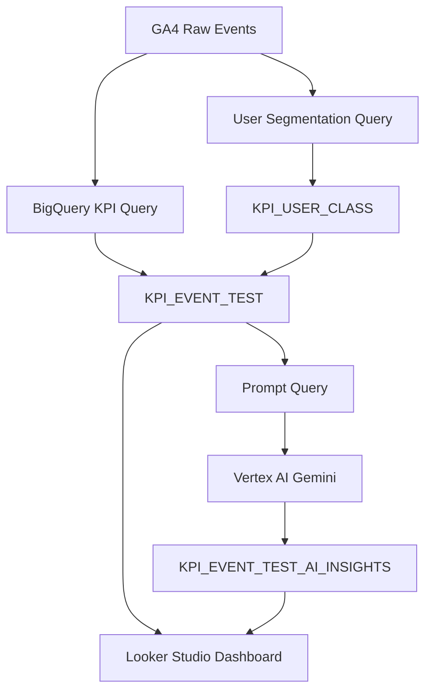

# Marketing KPI AI Insight Dashboard

GA4 BigQuery 데이터를 기반으로 이벤트별 마케팅 성과를 자동 집계하고, Vertex AI를 활용해 실행 액션 중심의 인사이트를 생성하는 마케팅 KPI 분석 대시보드 프로젝트입니다.

단순히 수치를 보여주는 리포트가 아니라, 각 이벤트가 현재 어떤 역할을 하고 있는지, 어떤 문제가 있는지, 앞으로 어떤 액션을 취해야 하는지를 빠르게 판단할 수 있도록 설계했습니다.

> 보안상 실제 운영 SQL, Python 코드, GCP 설정값, 인증 정보는 공개하지 않습니다.  
> 본 저장소는 프로젝트 구조, 분석 설계, 테이블 구조, 시각화 결과 중심의 포트폴리오 저장소입니다.

---

## 1. 프로젝트 배경

마케팅 이벤트 페이지는 유입, 참여, 구매, 매출 성과가 각각 다르게 나타납니다.

기존에는 이벤트별 성과를 수동으로 확인해야 했고, 다음과 같은 문제가 있었습니다.

- 이벤트별 유입은 많지만 구매로 이어지는지 즉시 판단하기 어려움
- 3개월, 1개월, 주차별 성과 흐름을 한눈에 보기 어려움
- 이벤트가 유입용인지, 구매 전환용인지, 참여 유도용인지 구분하기 어려움
- 데이터는 많지만 실제 액션으로 연결되는 해석이 부족함
- 담당자가 매번 수동으로 인사이트를 작성해야 함

이 프로젝트는 이러한 문제를 해결하기 위해 BigQuery, Cloud Run, Vertex AI, Looker Studio를 연결하여 자동화된 마케팅 성과 분석 시스템을 구축한 것입니다.

---

## 2. 프로젝트 목표

이 프로젝트의 목표는 다음과 같습니다.

1. GA4 이벤트 데이터를 기반으로 이벤트별 KPI 자동 생성
2. 3개월, 1개월, 주차 단위의 성과 흐름 비교
3. 유입, 구매전환, 참여전환, 매출, 객단가를 기준으로 이벤트 포지션 분석
4. 유저 군집 분석을 통해 이벤트별 방문자 특성 파악
5. Vertex AI를 활용해 이벤트별 요약과 실행 액션 자동 생성
6. Data Studio에서 실무자가 바로 확인할 수 있는 대시보드 구성

---

## 3. 전체 시스템 구조



---

## 4. 사용 기술

| 구분 | 사용 기술 |
|---|---|
| 데이터 소스 | GA4 Export |
| 데이터 웨어하우스 | BigQuery |
| 데이터 처리 | BigQuery SQL |
| AI 인사이트 생성 | Vertex AI Gemini |
| 자동화 실행 | Cloud Run Jobs |
| 스케줄링 | Cloud Scheduler |
| 시각화 | Looker Studio |
| 컨테이너 | Docker, Artifact Registry |
| 언어 | Python, SQL |

---

## 5. 대시보드 예시

### 5.1 이벤트 성과 대시보드


위 대시보드는 이벤트별 성과를 버블 차트와 테이블로 보여줍니다.

- X축: 페이지 반응 또는 전환 관련 지표
- Y축: 구매전환 또는 참여전환 지표
- 버블 크기: 유입 또는 매출 규모
- 색상: 이벤트 성과 유형 또는 추천 액션
- 필터: 기간, 이벤트코드, 생성일자

---

### 5.2 이벤트 포지션 분석


각 이벤트는 평균값을 기준으로 사분면에 배치됩니다.

| 구분 | 의미 |
|---|---|
| 페이지 반응 높음 + 구매전환 높음 | 핵심 성과 이벤트 |
| 페이지 반응 높음 + 구매전환 낮음 | 관심은 있으나 구매 설득 부족 |
| 페이지 반응 낮음 + 구매전환 높음 | 목적 구매 성향 |
| 페이지 반응 낮음 + 구매전환 낮음 | 개선 또는 종료 검토 필요 |

---

### 5.3 AI 인사이트 예시


AI 인사이트는 이벤트별로 다음 내용을 생성합니다.

- 짧은 요약 제목
- 현재 성과 위치
- 기간별 흐름 변화
- 문제 가능성
- 다음 실행 액션

예시:

```text
요약: 관심은 높지만 구매는 없음

인사이트:
사람들이 많이 둘러보고 다른 이벤트로도 잘 넘어간다.
하지만 구매로는 전혀 이어지지 않고, 관망형 유저 비중이 높은 편이다.
이벤트의 핵심 혜택을 더 명확히 보여주고, 기간 한정 프로모션을 추가해 구매를 유도해야 한다.
```

---
## 6. 주요 테이블 구조

### 6.1 KPI_EVENT_TEST

이벤트별 성과 지표를 저장하는 메인 테이블입니다.

| 컬럼 | 설명 |
|---|---|
| WDATE | 데이터 생성 기준일 |
| period_type | 분석 기간 유형 |
| start_date | 분석 시작일 |
| end_date | 분석 종료일 |
| EVENTCODE | 이벤트 코드 |
| event_url | 이벤트 URL |
| users | 유저 수 |
| ux_score | 페이지 반응 점수 |
| s_cvr | 구매 전환율 |
| i_cvr | 참여 전환율 |
| rev | 매출 |
| arppu | 구매자당 평균 매출 |
| g1_pct ~ g6_pct | 유저 군집별 비중 |
| g1_name ~ g6_name | 유저 군집명 |
| avg_ux | 기간 내 평균 페이지 반응 점수 |
| avg_s_cvr | 기간 내 평균 구매 전환율 |
| avg_i_cvr | 기간 내 평균 참여 전환율 |
| s_quad | 구매 관점 사분면 |
| s_act | 구매 관점 추천 액션 |
| i_quad | 참여 관점 사분면 |
| i_act | 참여 관점 추천 액션 |
| users_rank | 유입 순위 |
| rev_rank | 매출 순위 |
| ux_rank | 페이지 반응 순위 |
| s_cvr_rank | 구매 전환 순위 |
| i_cvr_rank | 참여 전환 순위 |
| arppu_rank | 객단가 순위 |
| IDX | 대시보드 연결용 인덱스 |

---

### 6.2 KPI_EVENT_TEST_AI_INSIGHTS

Vertex AI가 생성한 이벤트별 인사이트 결과 테이블입니다.

| 컬럼 | 설명 |
|---|---|
| WDATE | 인사이트 생성 기준일 |
| EVENTCODE | 이벤트 코드 |
| AI_SUMMARY | 짧은 요약 제목 |
| AI_INSIGHT | 실행 액션 중심의 상세 인사이트 |
| IDX | 이벤트 연결용 인덱스 |
| INSIGHT_TYPE | 3개월, 1개월, 주차, 전체 흐름 구분 |
| period_type | 기간 유형 |
| start_date | 기간 시작일 |
| end_date | 기간 종료일 |

---

### 6.3 KPI_USER_CLASS

유저 군집 분석 결과 테이블입니다.

| 컬럼 | 설명 |
|---|---|
| quarter_id | 분기 ID |
| unified_user_id | 통합 유저 ID |
| persona_group | 유저 군집 번호 |
| persona_name | Vertex AI가 생성한 군집명 |
| updated_at | 갱신 시각 |

---

## 7. 분석 로직

### 7.1 기간별 성과 비교

각 이벤트는 다음 기간 단위로 분석합니다.

| 기간 | 설명 |
|---|---|
| 3_MONTH | 최근 3개월 흐름 |
| 1_MONTH | 최근 1개월 흐름 |
| 1_WEEK | 주차별 흐름 |
| TOTAL | 3개월, 1개월, 주차 흐름을 종합한 인사이트 |

이를 통해 단순 현재 성과가 아니라 장기 대비 단기 변화와 최근 주차 흐름을 함께 판단합니다.

---

### 7.2 이벤트 순위 분석

각 이벤트는 같은 기간 내 전체 이벤트와 비교됩니다.

비교 지표는 다음과 같습니다.

- 유입 순위
- 매출 순위
- 페이지 반응 순위
- 구매 전환 순위
- 참여 전환 순위
- 객단가 순위

이를 통해 단순 수치가 아니라 전체 이벤트 안에서의 상대적 위치를 판단합니다.

---

### 7.3 사분면 분석

이벤트를 구매 관점과 참여 관점으로 나누어 사분면 분석을 수행합니다.

구매 관점 사분면은 다음과 같습니다.

| 구분 | 해석 |
|---|---|
| 페이지 반응 높음 + 구매전환 높음 | 핵심 성과 이벤트 |
| 페이지 반응 높음 + 구매전환 낮음 | 관심은 있으나 구매 설득 부족 |
| 페이지 반응 낮음 + 구매전환 높음 | 목적 구매 성향 |
| 페이지 반응 낮음 + 구매전환 낮음 | 개선 또는 종료 검토 필요 |

참여 관점 사분면은 다음과 같습니다.

| 구분 | 해석 |
|---|---|
| 페이지 반응 높음 + 참여전환 높음 | 참여 효율이 높은 이벤트 |
| 페이지 반응 높음 + 참여전환 낮음 | 둘러보지만 다음 행동이 약한 이벤트 |
| 페이지 반응 낮음 + 참여전환 높음 | 목적성 있는 참여 이벤트 |
| 페이지 반응 낮음 + 참여전환 낮음 | 전반적 개선이 필요한 이벤트 |

---

### 7.4 유저 군집 분석

유저 행동 데이터를 기반으로 KMeans 군집 분석을 수행했습니다.

활용 지표 예시는 다음과 같습니다.

- 방문 빈도
- 구매 횟수
- 누적 매출
- 페이지 체류 시간
- 클릭 수
- 스크롤 깊이
- 이동 경로
- 참여 행동

군집 결과는 Vertex AI를 통해 사람이 이해하기 쉬운 그룹명으로 변환했습니다.

| 그룹명 | 해석 |
|---|---|
| 단순 조회형 | 페이지를 가볍게 확인하는 유저 |
| 훑어보기형 | 빠르게 여러 정보를 탐색하는 유저 |
| 단건고액형 | 적은 횟수로 높은 금액을 결제하는 유저 |
| 스쳐가는형 | 짧게 방문하고 이탈하는 유저 |
| 관망형 | 관심은 있으나 구매를 미루는 유저 |

---

## 8. AI 인사이트 생성 방식

AI 인사이트는 단순 요약이 아니라 실행 액션 중심으로 생성되도록 설계했습니다.

프롬프트에는 다음 정보를 포함했습니다.

- 이벤트 코드
- 분석 기간
- 유입 수
- 매출
- 객단가
- 페이지 반응 점수
- 구매 전환율
- 참여 전환율
- 전체 이벤트 내 순위
- 사분면 위치
- 유저 군집 비중
- 유저 군집명
- 3개월, 1개월, 주차별 흐름

AI 출력 형식은 다음과 같이 제한했습니다.

```text
요약: 15자 이하의 짧은 제목
인사이트: 3문장 이내. 마지막 문장은 반드시 실행 액션
```

---

## 9. 자동화 구조

### 9.1 일별 자동화

매일 실행되는 작업입니다.

1. 이벤트 KPI 테이블 갱신
2. AI 인사이트 생성
3. Looker Studio 대시보드 갱신

---

### 9.2 분기별 자동화

분기마다 실행되는 작업입니다.

1. 유저 행동 데이터 기반 군집 분석
2. 유저 군집명 생성
3. KPI 테이블에서 신규 군집명 사용

---

## 10. 프로젝트에서 담당한 작업

- GA4 이벤트 데이터 구조 분석
- BigQuery 기반 이벤트 KPI 집계 로직 설계
- 3개월, 1개월, 주차별 기간 비교 구조 설계
- 이벤트별 사분면 분석 로직 설계
- 유저 군집 분석 구조 설계
- Vertex AI 기반 인사이트 프롬프트 설계
- Cloud Run Jobs 기반 자동화 구성
- Cloud Scheduler 기반 실행 스케줄 설계
- Looker Studio 대시보드 구성
- AI 인사이트 테이블과 시각화 필터 연결

---

## 11. 결과

이 프로젝트를 통해 이벤트별 성과를 단순 수치가 아닌 실행 액션 중심으로 확인할 수 있게 되었습니다.

기대 효과는 다음과 같습니다.

- 이벤트별 성과 판단 시간 단축
- 마케팅 액션 우선순위 선정 가능
- 유입은 많지만 구매가 약한 이벤트 식별
- 구매 전환은 높지만 확장 여지가 있는 이벤트 식별
- 최근 성과가 악화되는 이벤트 조기 발견
- 실무자가 바로 이해할 수 있는 자연어 인사이트 제공

---

## 12. 보안 및 공개 범위

본 저장소에는 실제 운영 코드와 인증 정보를 포함하지 않습니다.

공개하는 내용은 다음과 같습니다.

- 프로젝트 개요
- 대시보드 화면
- 테이블 구조
- 분석 로직 설명
- AI 인사이트 예시

공개하지 않는 내용은 다음과 같습니다.

- 실제 SQL 전문
- Python 실행 코드
- GCP 프로젝트 상세 설정
- 서비스 계정 정보
- 인증 키
- 내부 운영 URL
- 원본 GA4 데이터
